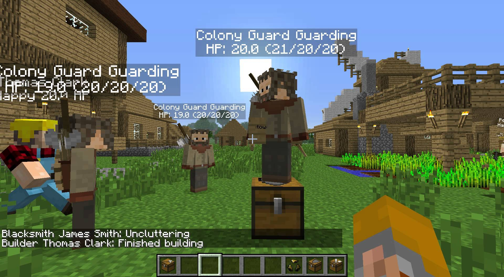
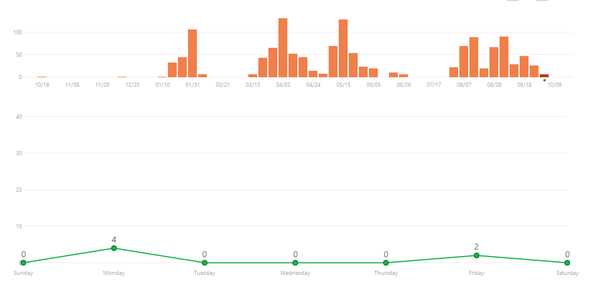

# Assignment 1 - Software Processes #

## Descrição do projeto ##

### Sobre o jogo ###

MineColonies é uma modificação do famoso jogo "Minecraft" da Mojang. Esta modificação permite a simulação de uma cidade através da adição de estruturas e trabalhadores NPC (Non Player Characters) que podem ser controlados pelo utilizador. Tal liberdade permite a construção desde pequenas aldeias eficientes especializadas num trabalhador até grandes e vibrantes metrópoles! As possibilidades são infinitas!

#### Funcionalidades dentro do jogo ####

A modificação permite ao utilizador gerar automaticamente navios, câmaras municipais, quintas, casas, entre outras estruturas e posteriormente associa-la a um trabalhador. Os trabalhadores, com os seus sistems de niveis e experiência, trabalham no seu ofício, e quanto maior for o seu nível, mais rápidos e eficientes eles são. Existe uma grande variedade de trabalhos, desde construtores, agricultores, mineiros até mesmo guardas da cidade ou carteiros.
Todas estas funcionalidades são feitas a partir do MineColonies, transformando assim o minecraft, um jogo no qual raramente se via outro humano, num jogo bastante diferente e mais emocionante!

## Processo de desenvolvimento ##

Um processo de desenvolvimento de software é a descrição de uma série de atividades requeridas para desenvolver um sistema de software. Vantagens: eficiência, consistência e uma base para melhorias.

### Comunidade ###

A comunidade MineColonies é formada por utilizadores e programadores do jogo. Além da sua [página oficial](www.minecolines.com) existe ainda um  [canal do youtube](https://www.youtube.com/channel/UCqXDtO68H7ulwXW6tSlbmqA) com vídeos oficiais do jogo. No site é possível receber as últimas novidades do jogo, aceder a fóruns, fazer download do jogo, seguir tutoriais e até inscrever-se como programador.
Os fóruns podem ser de comunicação entre jogadores, jogadores e programadores ou só entre programadores. Os programadores são bastante responsivos e dinâmicos.

### Publicações ###

MineColonies não é um projeto de raíz. Depois de conversar com alguns membros da equipa ([Marvin](https://github.com/Kostronor) e [Raycoms](https://github.com/Raycoms)), descobrimos que existia um projeto anterior que foi descontinuado pelo programador. Esse projeto era apenas singleplayer e teria diversos bugs. Mais tarde, um dos integrantes do atual grupo (que não é programador) decidiu pegar no antigo projeto e procurar novos programadores para uma nova abordagem do projeto. Esta nova abordagem data de 27 de abril de 2014.

Desde então, foram lançadas algumas versões do jogo:

  * 9 maio de 2016 (Minecolonies Alpha)
  * 7 setembro de 2016 (Minecolonies Alpha v0.2)
  * 3 outubro 2016 (Minecolonies Alpha v0.4)
 
As novas versões do jogo incluem modo multiplayer, mais trabalhadores, menos bugs e ainda algumas alterações a nível visual. Foi também lançado na primeira semana de outubro um servidor oficial.

### Repositório ###

O projecto é desenvolvido na linguagem java e normalmente utilizam o IntelliJ IDEA da JetBrains para programar e para a documentação do mesmo código.

O projeto MineColonies tem 13 contribuidores e está numa fase bastante ativa. No [último mês](https://github.com/Minecolonies/minecolonies/pulse/monthly) 6 autores fizeram mais de 300 commits em todos os branches,283 ficheiros foram modificados e houveram 4587 adições e 2891 eliminações; 40 issues foram resolvidas e surgiram 18 novas. A maior frequência de commits realizou-se ao longo do primeiro ano e desde o início deste ano (2016).

Com a contribuição do programador [Raycoms](https://github.com/Raycoms), conseguimos chegar à conclusão existe um núcleo de programadores. Este núcleo é formado por [Raycoms](https://github.com/Raycoms), [Colton](https://github.com/cltnschlosser) e [Marvin](https://github.com/Kostronor) que ocupam a maior percentagem de commits e modificações. Nenhum dos três trabalha a tempo inteiro no projeto. 'raycom' explicou-nos que a maior ou menor afluência de trabalho depende apenas da disponibilidade de cada contribuidor. Todos os outros contribuidores são programadores que de alguma forma decidiram deixar a sua pequena contribuição neste projeto open source. 

(falta falar dos branches e millestones)

### Fase do projeto ###

Um projeto pode ser dividido em várias fases: especificação, design e implementação, validação e evolução.
Neste caso o nosso projeto encontra-se em fase de evolução, visto que já foi publicado e está suscetivel a críticas e opiniões por parte dos utilizadores.
A fase de evolução deste projeto é caracterizada em dois tipos:

  * Corretiva : existem bugs reportados pela comunidade que são convertidos em [issues](https://github.com/Minecolonies/minecolonies/issues). Estes issues são uma prioridade para a equipa.
  * Perfetiva : existem diversa funcionalidades que estão na [TODO list](http://www.minecolonies.com/forum/m/9402108/viewthread/8293794-main-todo-list) a médio e longo prazo para serem ou implementadas ou melhoradas. 

### Modelo de desenvolvimento ###

Um modelo de um processo de desenvolvimento de software é uma representação abstrata de um processo.

Depois de uma análise ao projeto e alguns esclarecimentos por parte da equipa, mais especificamente por [Marvin](https://github.com/Kostronor), chegamos à conclusão que este projeto se inclui no modelo "incremental development and delivery". 

> "Each feature is a different branch, each commit gets build as a jar and each merged pr gets released to the public 
> automatically. We have a somewhat agile style but our workflow is young and we tweak things where we se fit from time to     > time" - [Marvin](https://github.com/Kostronor) 

Este modelo consiste em desenvolver o projeto aos poucos, avaliando cada incremento antes de proceder ao próximo. Neste projeto é possível aplicar o modelo "incremental development and delivery" devido à estruturação pessoa-branch verificada ao longo do projeto. Isto significa que cada pessoa é reponsável por um branch, que por sua vez está associado a um issue (ou seja, o programador cria um branch para resolver esse issue). 

> "If someone wants to work on an issue he assigns himself, creates a feature branch `feature/#<issuenr>-some-titel-text` and 
> starts working." - [Marvin](https://github.com/Kostronor)

Depois de resolvido executa um pull request que será analisado por um dos elementos do núcleo. Se correto, junta-se ao development branch que, como é um projeto open source, está disponivel para o público. Deste modo, a cada incremento é executada uma entrega! Após várias issues resolvidos, ou até uma nova funcionalidade é lançada então uma nova versão. 

O modelo "incremental development and delivery" tem várias vantagens como: menos documentação para mudar, feedback mais rápido, menos riscos do projeto falhar, e mais testes. A principal desvantagem passa por cada branch ter de ser verificado para não existirem conflitos.

### Estruturação ###

#### Equipa ####

Após fazermos algumas perguntas sobre o desenvolvimento do projeto aos programadores encarregues do MineColonies conseguimos concluir que a maior parte da comunicação é feita via [Slack](https://minecolonies.slack.com/). O [fórum](http://www.minecolonies.com/publicforum) é utilizado especialmente para falar com a comunidade não programadora, isto é, para receber feedback dos jogadores sobre o projeto.

Relativamente ao trabalho em si, geralmente todos os contribuidores trabalham naquilo que querem e no que mais apreciam. Quando existe uma grande mudança no jogo base, por exemplo, mudanças de versões do minecraft, a fluidez do trabalho pode mudar, mas na maior parte dos casos, existe alguém responsável que expõem algumas coisas que são precisas fazer e, a partir daí, os contribuidores escolhem o que fazem.

#### Código ####

Relativamente ao código em si, é exigido aos contribuidores que sigam [regras](https://github.com/Minecolonies/minecolonies/wiki) bastante específicas que vão até ao ponto de mencionar como devem colocar as chavetas em cada função. Embora sejam regras que possam parecer excessivas, num projeto open source é conveniente que todos tenham a mesma maneira de implementar código, visto que programadores podem entrar ou sair a qualquer momento. 

O código é estruturado em branches e são também usados testes unitários.

Existem 3 mantenedores que maioritariamente verificam o código submitido e após estar pronto, utilizam o SonarQube que irá comentar todos os possíveis problemas que encontrou. Finalmente quando todos os mantenedores verificarem o trabalho do SonarQube (e feito as devidas alterações) o trabalho do programador pode ser implementado.

> "We maintainers ( @raycoms @colton and myself ) are reviewing code if requested in #code-review and we look over most commits > to check if we spot grave mistakes" - [Marvin](https://github.com/Kostronor)

Cada ponto a trabalhar geralmente é feito apenas por uma pessoa, embora possa haver ajuda, o minecolonies costuma ser um projeto em que se segue uma política de "one branch one person".

## Opiniões, Críticas e Alternativas ##

### Comparação com outros modelos ###

Na nossa opinião, o método de processo que a equipa do MineColonies utiliza é o mais adequado ao tipo de projeto pois torna a maneira como o projeto evolui bastante mais dinâmica do que qualquer outro modelo. 
Comparando com o modelo de cascata, apesar deste poder ser utilizado, não seria tão adequado uma vez que modificações de minecraft é um mercado bastante competitivo, por isto, cada modificação tem de seguir um modelo propício à inovação rápida e com bastantes novidades; se tal não acontecer a modificação rapidamente perderá a adesão que tem pois ficará "velho" rapidamente.
Relativamente aos modelos de protótipo de software e reutilização de software, consideramos que neste tipo de projetos não são propriamente possíveis de implementar com sucesso pois são dirigidos a projetos de grandes empresas que querem ou validar e tirar conclusões com um protótipo ou poupar dinheiro em código. Ora, visto que é um projeto open source que é feito por quem quiser e sem pagamentos, poupar dinheiro em código está fora de questão. Lançar um protótipo, pelo menos nesta fase já avançada, nao faria muito sentido uma vez que acarretaria um volume de trabalho desnecessário excessiva à execução do mesmo.
Ao utilizar o método da incrementação, a exposição e adesão que o "mod" recebe crescem substancialmente com cada novo update!