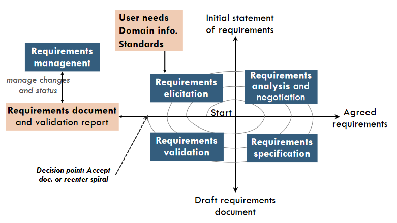
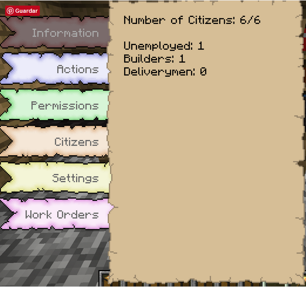
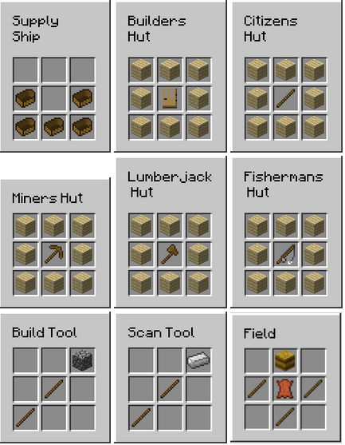
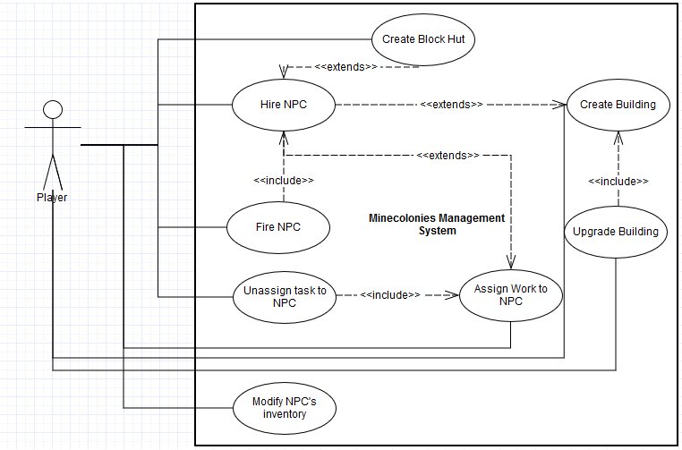
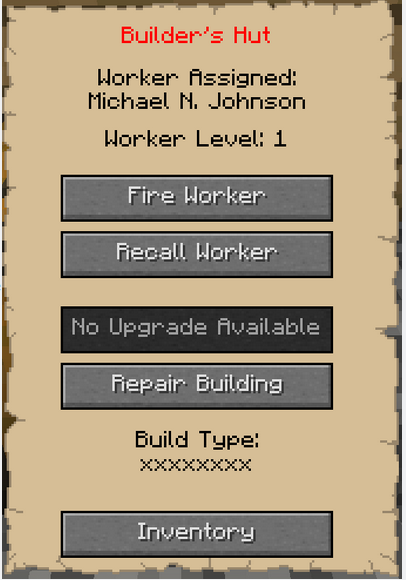
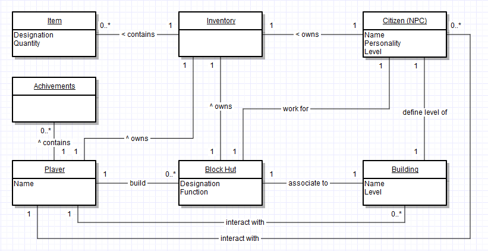

# Assignment 2 - Requirement Elicitation #

## Introdução ##

Desde o início de qualquer projeto até à sua conclusão, existem alguns aspetos imprescindíveis para o sucesso e eficácia do mesmo. Uma comunicação clara e objetiva entre qualquer membro associado, é um deles. Num grupo de trabalho, quanto mais depressa houver um entendimento pelos membros do projeto, melhor será a vida do mesmo. Para tal é necessário aplicar conceitos da “*engenharia de requerimentos e prototipagem*”.

No âmbito do caso específico do **MineColonies**, para além da investigação feita, foram feitas questões aos responsáveis sobre os critérios usados pelos membros da equipa  para determinar qual o rumo que o projeto deve seguir.

## Âmbito / Propósito ##

Engenharia de requerimentos é o processo de estudo de um utilizador de modo a atingir os requerimentos de software, ou seja, aos requerimentos do programa a ser implementado.

A engenharia de requerimentos é um processo muito importante no desenvolvimento de um projeto, pois permite a maior eficiência do mesmo, devido à análise requerida do projeto. Esta análise permite a deteção de erros mais cedo, e a sua prevenção.

**MineColonies** tem como propósito de cativar os jogadores de Minecraft a encarar o jogo de uma maneira um pouco diferente, tornando-o mais rico e interativo. Ao facilitar o desenvolvimento do mundo do jogador de uma maneira bastante mais rápida face ao jogo base, esta modificação cria uma dinâmica nunca anteriormente vista!

O âmbito deste trabalho é focar-se na essência desta engenharia, identificando quais os grandes objetivos da boa interpretação do desenvolvimento de projetos em geral, bem como na utilidade das técnicas para obter bom feedback de todas as entidades envolvidas já existentes.

## Descrição ##

A engenharia de requerimentos passa por várias fases: levantamento de requerimentos, análise e negociação de requerimentos, especificação de requerimentos e validação de requerimentos. Neste relatório vamo-nos focar no levantamento de requerimentos.

Figura 1 - *Gráfico com a representação das várias fases da enhenharia de requerimentos.*

### Levantamento de requerimentos ###

O principal objetivo do levantamento de requerimentos é a interação com os *stakeholders* de modo a descobrir os seus requerimentos. Para tal é necessário usar várias técnicas como inquéritos, questionários, observações sociais, protótipos, entre outros. No caso do **MineColonies**, por ser um projeto *open source* e sem fins lucrativos, os seus contribuidores não estão propriamente interessados na utilização de técnicas mais profissionais para conhecer o seu público alvo. 

Os únicos meios são então os [fóruns](http://www.minecolonies.com/publicforum) onde são analisadas críticas e sugestões deixadas pelos utilizadores, e os [pull requests](https://github.com/Minecolonies/minecolonies/pulls) dos contribuidores.

### Problemas ###

Relativamente à modificação **MineColonies**, não existem grandes problemas relativos à comunicação entre utilizadores e programadores visto que a maior parte de sugestões já foram pensadas pelos programadores e já estão implementadas ou estão em numa lista à espera que alguém as comece.

> "Probably 95% of suggestions are things we have already thought about and are on the to-do list." - [Pmardle](https://github.com/pmardle)

Assim, são maioritariamente os programadores que regem o futuro da modificação.

Como neste projeto, é seguida a política “*one man one branch*”, acaba por não haver muitos dos problemas de comunicação em equipa. No entanto, pode não acontecer o mesmo com os utilizadores. Embora o interesse por parte dos responsáveis em satisfazer os pedidos da comunidade seja enorme, infelizmente, devido à falta de tempo e de programadores, por vezes são negadas algumas sugestões. Entre elas, estão updates a versões antigas da modificação. Por exemplo: o Minecraft é regido por versões (sendo bastante popular a 1.7.10), por isso, jogadores que utilizem esta versão do Minecraft têm dificuldade em utilizar a modificação (apenas versões antigas do **MineColonies** têm compatibilidade com a versão 1.7.10).

### Técnicas ###

Uma das técnicas usadas pela equipa do **MineColonies** é a prototipagem. Como a equipa necessita de ajuda para validar algumas implementações específicas, utilizam um sistema de [*Patreons*](https://www.patreon.com/minecolonies).

> "We often release versions that aren't finished for people to pay with and give initial feedback. " - [Pmardle](https://github.com/pmardle)

Um *Patreon* é um utilizador que paga para receber benefícios sobre o jogo. O principal benefício neste jogo é o teste de protótipos lançados pela equipa. Um *Patreon* tem acesso a versões de teste da modificação, o que permite aos contribuidores identificar erros e receber feedbacks com muita antecedência. Desta maneira é possível poupar recursos na correcção de bugs e evitar problemas de implementações mal recebidas pela comunidade.

Outra técnica de levantamento de requerimentos é a trasmissão de sugestões via [fóruns](http://www.minecolonies.com/publicforum). A comunicação é feita via fórum pelos utilizadores, de maneira a que todos possam ver as sugestões já feitas, as implementações que estão a ser executadas e as implementações planeadas. 

Para a comunicação entre programadores, é também utilizado o github na divisão de tarefas, dividindo o trabalho em [*branches*](https://github.com/Minecolonies/minecolonies/branches) e apenas recebendo o código no repositório principal quando este está a funcionar sem problemas.

### Análise, negociação e validação de requerimentos ###

A decisão do que das próximas implementações é feita em função do que já está feito, do que a modificação necessita e também tendo em conta as opiniões da [comunidade](http://minecolonies.com/). 

> "Generally it's dictated by a real need of the mod.. or it is something a particular coder is interested in..  occasionally the community feedback is taken into account too." - [Pmardle](https://github.com/pmardle)

Um exemplo disto será o caso dos guardas. Tendo esta funcionalidade recebido uma grande quantidade de pedidos devido à sua popularidade e necessidade por parte da comunidade, os programadores resolveram desenvolvê-la mais cedo e com várias alterações pedidas pela comunidade.

## Requerimentos específicos e funcionalidades ##

**Minecolonies** é uma modificação do Minecraft que se baseia na gestão de uma cidade através dos vários residentes e trabalhadores.Tendo o jogo base já as suas funcionalidades, este projeto proporciona aos utilizadores uma nova perspetiva oferecendo novas características, itens e regras, sob as do jogo base, de forma a contextualizar a ideia principal.

### Requerimentos funcionais ###

#### Estruturas ####

Para simular o comportamento de uma cidade foram implementados dois tipos de estruturas essenciais: a *town hall* e o *supply ship*. O jogo não deve iniciar sem a colocação destas estruturas.

Além destas duas estruturas, ainda existem as construções associadas a um *block hut*. Estas estruturas são construidas por um trabalhador do tipo *builder* e podem subir de nível de acordo do o *NPC* associado a essa estrutura.

##### Town Hall #####

O *town hall* representa o centro da área protegida em que se insere a cidade. No início, podemos posicionar a câmara onde quisermos, desde que não incida sobre outra cidade, mas uma vez posicionada não pode ser deslocada para outro sítio. O raio da cidade pode também ser definido.

Esta estrutura permite obter informações e fazer a gestão de residentes e trabalhadores (*NPC's*), criar nova *town hall* (nova cidade), reparar, alterar o nome, nomes e permissões de acesso a outros jogadores conforme um rank, modificar o modo de contratação (manual/automático), entre outros.

Figura 2 - *Representação da janela de interação da estrutura Town Hall.*

##### Supply Ships #####

O *Supply ship* representa o posto de abastecimento da cidade bem como a primeira casa do jogador. Esta estrutura tem que ser posicionada sob uma grande porção de água e não podem ser colocadas mais estruturas deste tipo no mesmo mundo.

#### Npc's ####

Os *NPC's* do **MineColonies** podem ser divididos em vários tipos: *builder, farmer, fisherman, baker, lumberjack, miner, crafter, guard, hunter, blacksmith, stonemason, deliveryman* e *citizen*. Cada *NPC* dos tipos acima referidos tem um conjunto de características e funcionalidades próprias, desempenhando, cada um, um papel único. O número de *NPC's* por cidade é ilimitado.

Figura 3 - *Visualização dos vários NPC's.* 

#### Crafts ####

Como complemento para o bom funcionamento das ideias a pôr em prática, foram adicionados novos objetos que podemos construir através da *crafting table* do jogo base. Os objetos novos são: *supply ship, builders hut, citizens hut, miners hut,lumberjack hut, fishermans hut, build tool, scan tool* e *field*. Estes objetos são essenciais para pôr em práticas as funcionalidades de determinados *NPC's* e para gestão da cidade.

Figura 4 - *Crafting table com as diversas combinações para a formação dos novos objetos.*

#### Achievements ####

A modificação também disponibiliza uma expansão e um melhoramento ao sistema de conquistas implementado no jogo base. Este sistema é uma adição ao vasto leque de novidades que **Minecolonies** traz ao jogo que torna a experiência dos jogadores bastante mais agradável, cobrindo vários tópicos como o inicial de “construir um supply ship” ou o de “criar NPC’s”. Esta funcionalidade apenas serve para melhorar a qualidade de jogo, não tendo nenhuma recompensa para além de ter uma lista de proezas completadas, mas também tem a particularidade de servir de uma espécie de guia interativo para novos jogadores.

Figura 5 - *Exemplo de achivements.*

### Requerimentos não funcionais ###

Em geral, este projeto, não requer atributos nem funcionalidades específicas, por parte dos clientes, visto que é uma modificação de um jogo já implementado. Desta forma, a ideia do projeto partiu essencialmente da iniciativa dos programadores. No entanto, por ser uma extensão de um jogo, está sujeito a determinadas condições necessárias para garantir a compatibilidade e não comprometer o bom funcionamento do mesmo. Uma dessas condições é a linguagem de programação ter que ser a mesma, neste caso, o java. O desempenho e execução da modificação têm que ser elevadas e para isto, os algoritmos a usar são fundamentais. A escalabilidade também é um fator muito importante para assegurar a implementação de novas features no futuro sem grandes problemas.

## Diagrama de casos de uso ##

O modelo de casos de uso é uma sequência de transições num sistema visto da perspetiva de um ator.
Para o projeto **MineColonies**, criamos este modelo de casos de uso que descreve o sistema de manipulação dos objetos pelo ator que é o jogador. Este modelo não tem em consideração as possibilidades do jogo original Minecraft, mas sim as novas funcionalidades implementadas para o **MineColonies**.

Figura 6 - *Diagrama de casos de uso.*

Como é possível interpretar pela imagem, o jogador é o único ator deste sistema e tem controlo sob todas as ações. De seguida estão apresentadas duas descrições de dois casos de uso.

*Nome :* Retirar uma tarefa dum NPC.

*Atores :* Jogador.

*Objetivo :* retirar um NPC da sua tarefa atual.

*Referência para requerimentos :* NPC's e Crafts.

*Pré condições :* 

* NPC deve estar empregado.
* A tarefa deve constar na lista de tarefas não concluídas do NPC

*Descrição :*

1. O jogador seleciona o NPC que deseja retirar a tarefa.
2. O NPC mostra uma janela para a confirmação.
3. O jogador confirma.
4. O NPC deixa essa tarefa

*Pós condições :*

1. O NPC avança para a próxima tarefa da lista.

Figura 7 - *Exemplo da janela de interação do Builder Hut.*

*Nome :* Atualizar um edifício.

*Atores :* Jogador.

*Objetivo :* Atualizar um edifício de um NPC.

*Referência para requerimentos :* Crafts, NPC's e Estruturas.

*Pré condições :*

* Deve existir um NPC do tipo Builder.
* Deve existir esse edifício.
* O nível do NPC associado a esse edifício deve ser superior ao nível do edifício.

*Descrição :*

1. O jogador seleciona o edifício que deseja evoluir.
2. O sistema mostra uma janela de escolha do NPC do tipo Builder que irá construir.
3. O jogador escolhe o NPC.
4. O sistema mostra uma janela de confirmação.

*Pós condições :*

1. É adicionada a tarefa “Upgrade Building x “ ao NPC do tipo Builder
2. O NPC evoluí o edifício.

## Modelo de domínio ##

O modelo de domínio é um modelo que representa um conjunto de classes conceptuais que descrevem as relações do jogo.

Figura 8 - *Modelo de domínio.*

Como é possível interpretar da imagem, as classes principais são: jogador, citizen(NPC), Block Hut e Building. A classe Inventory é também importante pois é meio de relação entre o *NPC* e o jogador. O jogador pode, por exemplo, colocar materiais que o NPC necessite no seu inventário, e recolher os produtos do *NPC*. 

Como também pode ser interpretado pela imagem, cada personagem/*block hut* apenas tem um inventário, e um block hut está apenas relacionado a um citizen e a um building. 

Os *achivements* são apenas propriedade do jogador, sem qualquer relação às restantes classes.

## Conclusão ##

Com este trabalho, conseguimos concluir que o levantamento de requerimentos é uma fase muito importante para qualquer projeto. Aprendemos que a comunicação com os *stakeholders* e a toda a análise da informação recolhida, são aspetos fulcrais para que um projeto tenha o seu devido sucesso. 

Relativamente ao caso do **MineColonies**, chegamos à conclusão que a equipa não tem grandes problemas relacionados com este tópico. Embora haja levantamento de requerimentos, a equipa acaba por seguir mais a vontade dos programadores. No entanto, o facto de usarem algumas técnicas de levantamento de requerimentos, ajuda-os a evitar alguns problemas, e a agradar os seus *stakeholders*, que neste caso serão os seus utilizadores.

## Contribuições ##

* [Inês Gomes](https://github.com/inesgomes) (up201405778@fe.up.pt)

* [Catarina Ramos](https://github.com/catramos96) (up201406219@fe.up.pt)

* [Mário Fernandes](https://github.com/MarioFernandes73) (up201201705@fe.up.pt) 

* [Manuel Curral](https://github.com/Camolas)  (up201202445@fe.up.pt)
