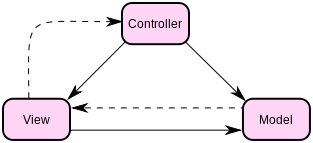
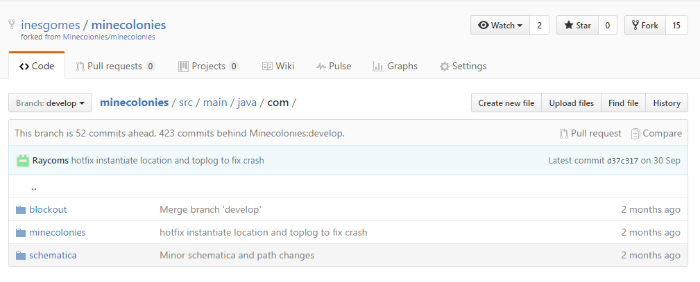
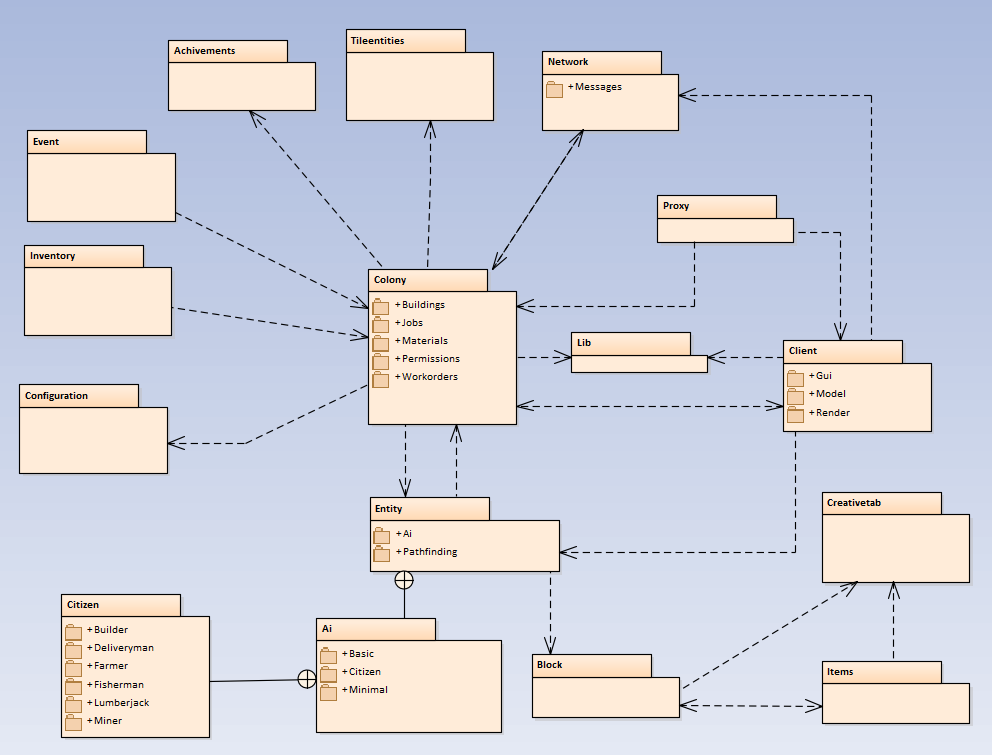
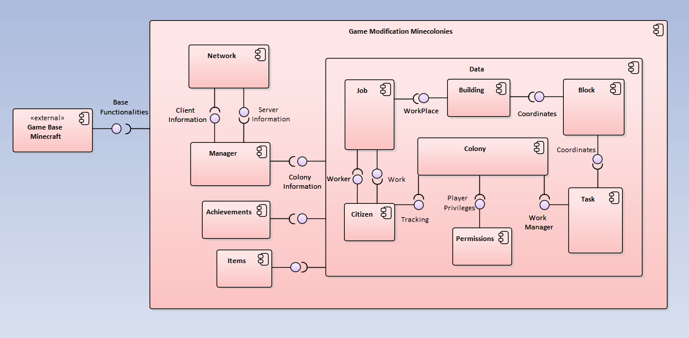
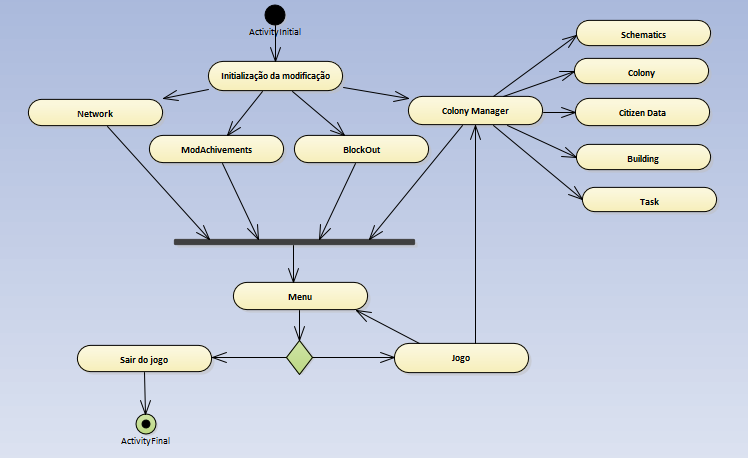

# Assignment 3 - Software Design #

## Introdução ##

Arquitetura de software é a organização de um sistema que incorpora os seus componentes e as suas relações, entre si e com outros sistemas. Estas relações permitem o design e evolução do projeto. Regra geral, a arquitetura de software é muito importante pois compromete todas as decisões de organização e elaboração num sistema de software.

Um dos principais conceitos adjacentes à arquitetura de software é o design. Neste projeto, para representar o design de alto nível (ou design de arquitetura) é usado o modelo 4+1. Este modelo é constituído por 4 vistas + 1 caso de uso que as complementam. Neste caso, [o caso de uso](https://github.com/inesgomes/minecolonies/blob/develop/ESOF-docs/Assignment2.md) correspondente encontra-se no relatório anterior. Os modelos correspondentes às vistas [lógica](#logical), [development](#development), [deployment](#deployment) e [processo](#process) podem ser analisados nas secções seguintes.

As arquiteturas de software também podem seguir padrões. Um padrão de desenho é um meio de representação, partilha e reutilização de conhecimento que descreve uma solução provada para um problema recorrente num dado contexto. Baseado neste conceito, um padrão arquitetural é um padrão estilizado de boas práticas de design arquitetural provadas em diferentes ambientes. Existem vários padrões arquiteturais diferentes, cada um com uma solução, contexto e problema diferentes. Para o **MineColonies** o padrão mais adequado é o padrão MVC. 

Figura 1 - *Esquema que exemplifica o modelo Model-View-Controller com as relações entre as partes lógicas*

Este padrão caracteriza-se pela separação da representação, interação e da aplicação, estruturando o sistema em três partes lógicas que interagem entre elas. *Model* consiste nos dados da aplicação, lógica e funções. *View* é a parte lógica encarregue da saída da representação dos dados. *Controller* é a parte que recebe a entrada, convertendo-a em comandos para o modelo ou visão. O padrão MVC adequa-se a este projeto pois já era usado pelo jogo **Minecraft**, e sendo o **MineColonies** uma modificação, deve seguir o mesmo padrão.

> "I think we're pretty controlled by minecraft in this case. Since minecraft is separated in client and server, we're also are. Therefore, we have a client side which is what is visible to the player. Like models, GUI's and the interaction with our entities. Which is probably the View, and if the player interactions with this side, his actions are send to our application through some messaging classes. So we're probably pretty close to the model view controller architecture. We're usually trying to separate our code in logical groups. To leave classes light  alI free from clutter. " - [Raycoms](https://github.com/Raycoms)

Analisando a imagem seguinte é possível observar as três partes lógicas do programa *View* (blockout), *Model* (minecolonies) e *Controller* (schematica). 

Figura 2 - *Demonstração do modelo MVC no projeto MineColonies*

As ideias base deste modelo são a reusabilidade de código e separação de conceitos. O padrão reúne ainda inúmeras vantagens como, permitir que os dados e a sua representação mudem independentemente, suporta a apresentação de dados de diferentes maneiras, e ainda permite que alterações de dados sejam visíveis em todas as partes. No entanto pode ter a desvantagem de sobrecarga do código quando existem modelos pequenos. Neste caso esta desvantagem não se aplica, devido à grande escala do projeto.

<a name="logical"/>
## Logical View ##

A vista lógica consiste num conjunto de ideias que servem de suporte para a elaboração de um sistema de software que encontre uma solução adequada ao problema detectado. O objetivo desta vista é responsável por transmitir como o sistema de software se encontra estruturalmente organizado a nível de comunicação, computacional e comportamental. Este diagrama  é responsável por representar as abstrações principais (objetos, classes ou packages),  bem como as relações que existem entre elas.

Figura 3 - *Diagrama que representa a logical view do projeto MineColonies*

O projeto MineColonies é geralmente composto por packages com uma ou duas camadas, mas como se pode observar no diagrama existem alguns elementos que estão para além da quarta camada (por exemplo, Citizen).
Na representação desta vista decidiu-se ocultar alguns packages menos relevantes devido à quantidade excessiva de informação, que para além de tornar o diagrama confuso, iria reduzir lhe consideravelmente a utilidade. Desta forma, optamos por dar mais ênfase às componentes funcionais do modo de jogo que são o entity e o colonies.

<a name="development"/>
## Development View ##

Figura 4 - *Diagrama que representa a development view do projeto MineColonies*

Sendo o **MineColonies** uma modificação de um outro jogo (**Minecraft**), existem muitas funcionalidades base que terão que ser reutilizadas e outras alteradas de forma a conseguir enquadrar as novas funcionalidades. Por esta razão, no *Development View*, a componente *Game Modification Minecolonies* depende da componente *Game Base Minecraft*.

Dentro da componente *Game Modification Minecolonies*, a componente *Manager* faz o tratamento, tanto da parte do cliente, como da parte do servidor, da informação recebida/enviada através da componente de *Network*, que trata das ligações cliente-servidor via proxy. A informação é tratada conforme o disponibilizado pela componente *Data*. Esta última, caracteriza toda a nova informação implementada pela modificação e que, por sua vez, depende de *Items* que define os novos itens inseridos no jogo. Temos ainda a componente *Achievements* que representa os novos tipo de objetivos alcançados pelo jogador. Esta componente depende da informação na componente *Data*.
	
Dentro da componente *Data*, a componente *Colony*, que define a colónia e a sua gestão, tem dependências diretas com as componentes: *Citizen*, *Permissions* e *Task*. A primeira, traduz os cidadãos da colónia que podem ou não estar empregados, daí a sua dependência com a componente *Job*. Esta última, depende da componente *Building*, onde o trabalho tem lugar, e da componente *Citizen*, os empregados. A componente *Building* está relacionado com um *Block* específico dependendo do tipo de trabalho a executar. *Permissions* é a componente que permite à colónia definir os privilégios para cada jogador. Já a componente *Task* permite fazer a gestão de trabalhos na colónia e os seus cidadãos, incluindo a construção de novos edifícios, daí a dependência com *Block*.

<a name="deployment"/>
## Deployment View ##

Uma vista de processo mostra em run-time a interação entre processos do sistema. MineColonies é uma modificação de Minecraft, e como tal os seus processos estão essencialmente relacionados com inicialização do jogo e o paralelismo de guardar/aceder estruturas de dados enquanto o utilizador joga. Estes processos são descritos no diagrama de atividades seguinte.

Figura 5 - *Diagrama que representa a deployment view do projeto MineColonies*

De acordo com o diagrama, é possível observar que existem três elementos obrigatórios para a utilização do **MineColonies**: um computador, um sistema operativo compatível e uma versão do jogo **Minecraft** com a modificação **MineColonies** instalada. O computador deverá obedecer aos seguintes requisitos mínimos:

* CPU: Intel Pentium D or AMD Athlon 64 (K8) 2.6 GHz
* RAM: 2GB
* GPU (Integrated): Intel HD Graphics or AMD (formerly ATI) Radeon HD Graphics with OpenGL 2.1
* GPU (Discrete): Nvidia GeForce 9600 GT or AMD Radeon HD 2400 with OpenGL 3.1
* HDD: At least 200MB for Game Core and Other Files
* Java 6 Release 45

O sistema operativo terá de ter o jogo **Minecraft** instalado que por sua vez terá de ter a modificação **MineColonies**. Esta modificação depende bastante da versão do **Minecraft** no computador do utilizador por razões de compatibilidade.

<a name="process"/>
## Process View ##

Uma vista de processo mostra em *run-time* a interação entre processos do sistema. **MineColonies** é uma modificação de **Minecraft**, e como tal os seus processos estão essencialmente relacionados com inicialização do jogo e o paralelismo de guardar/aceder estruturas de dados enquanto o utilizador joga. Estes processos são descritos no diagrama de atividades seguinte.

Figura 6 - *Diagrama que representa a process view do projeto MineColonies*

Como se pode observar, após a inicialização do jogo, são executados os seguintes processos:

* *GUI* : neste caso a biblioteca *blockout* para o **Minecraft**, que executa toda a parte gráfica;
* *Network* : ligações cliente-servidor via proxy;
* *ModAchivements* : conquistas do jogo são inicializados;
* *ColonyManager* : processo muito importante, com lado servidor e cliente, que tem como principal objetivo fornecer uma residência permanente para estruturas de dados e sistemas que gerem a colónia, removendo dependências do **Minecraft**, e de entidades a serem carregadas. 

Todos estes processos permitem então que se inicie o processo *Menu* do **Minecraft**, que permite jogar, ou sair do jogo, finalizando o diagrama de atividade. Os processos de inicialização e o processo onde decorre o jogo ocorrem em paralelo, pois o jogo precisa de todos os processo da inicialização para correr.

## Contribuições ##

* [Inês Gomes](https://github.com/inesgomes) (up201405778@fe.up.pt) - 25% - horas: 5

* [Catarina Ramos](https://github.com/catramos96) (up201406219@fe.up.pt) - 25% - horas: 5

* [Mário Fernandes](https://github.com/MarioFernandes73) (up201201705@fe.up.pt) - 25% - horas: 5

* [Manuel Curral](https://github.com/Camolas)  (up201202445@fe.up.pt) - 25% - horas: 5
