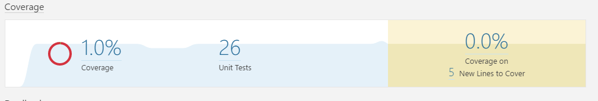
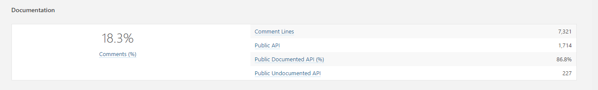
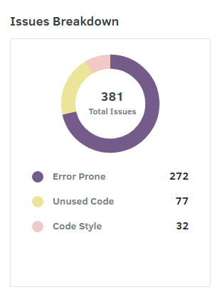
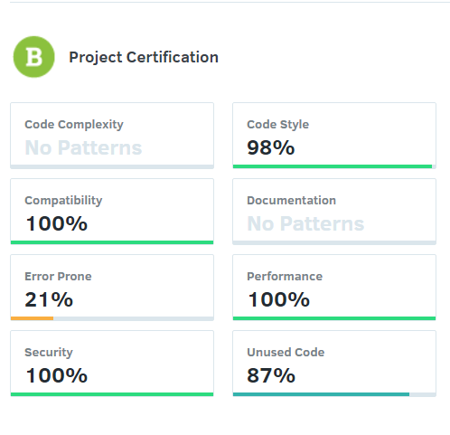
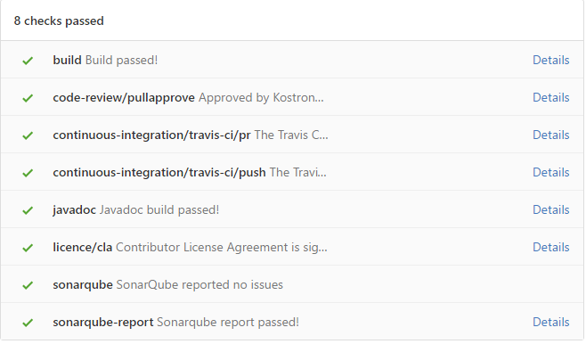

# Assignment 4 - Verification and Validation #

## Introdução ##

A etapa de verificação e validação está entre a fase de implementação e a de evolução ou manutenção no desenvolvimento de um sistema de software. O objectivo é garantir que os padrões de qualidade são alcançados. Estes padrões passam pela satisfação dos requisitos funcionais (salvaguardar a consistência e a não redundância da sua recolha e negociação) de desempenho e normas.

A validação tem a missão de assegurar o cumprimento dos requisitos pré-estabelecidos (completamente e corretamente ou seja, o *software* correto foi produzido).

A verificação vem garantir que o *software* foi construído corretamente, completamente e consistentemente em cada e entre fases consecutivas do ciclo de vida do software. Para esta verificação usa-se  duas técnicas de modo a aferir o cumprimento dos requisitos:

* Técnica estática : consiste em análises e inspeções, sem recorrer a execução, do código.  

* Técnica dinâmica : são os chamados Testes que examinam o comportamento do software através da sua execução .
	
Este processo permite encontrar *bugs* que é uma atividade fundamental para garantir qualidade do software, pois revela erros ainda não descobertos.

## Testabilidade e Review do Software ##

No **MineColonies**, modificação do jogo **Minecraft**, podem existir inúmeros estados de jogo possíveis devido à grande quantidade de objetos em jogo. Sendo um estado de jogo caracterizada pelo conjunto de todos os objetos envolventes num estado específico, podemos concluir que, testar todos os estados de jogo possíveis é muito difícil ou até mesmo quase impossível. No entanto, o grau de testabilidade depende de muitos outros factores como: a [controlabilidade](#controlabilidade), [observabilidade](#observabilidade), [isolabilidade](#isolabilidade), [separação de responsabilidades](#responsabilidades), [documentação e facilidade de leitura](#documentacao) e da [heterogeneidade](#heterogeneidade). Em geral, tendo em conta a informação recolhida, a testabilidade no **MineColonies** é razoavelmente boa como veremos nos tópicos abaixo.

A testabilidade no **MineColonies** deve-se focar apenas nas novas funcionalidades implementadas, excluindo, portanto, a componente externa que são as funcionalidades bases do **Minecraft**. Assim sendo, ao testar estas novas funcionalidades, temos que supor que, eventuais problemas que possam aparecer na execução dos testes, não provenham desse componente externo.

<a name="controlabilidade"/>
### Controlabilidade ###

> "How easy it is to provide a program with the needed inputs, in terms of values, operations, and behaviors." - Introduction to Software Testing, page 36, Paul Ammann and Jeff Offputt

Sendo o **MineColonies** uma modificação de um jogo, é natural a existência de diversas interações entre os diferentes objetos. Além das interações possíveis, é necessário ter em conta que cada objeto tem uma panóplia de estados, aumentando o número de combinações possíveis para estados de jogo. Assim, a obtenção de um estado de jogo é fortemente dependente de outros objetos e dos seus estados, o que nem sempre é fácil e direto de alcançar.  Isto deve-se à existência de regras no jogo, em que, para obter um comportamento em particular é necessário uma sucessão de acontecimentos, por vezes, muito específica. 

Tendo em conta os aspectos referidos, podemos afirmar que, a controlabilidade depende do número de objetos em jogo cujo estado é relevante e o quão direto é obter esse estado em particular.

<a name="observabilidade"/>
### Observabilidade ###

> "How easy it is to observe the behavior of a program in terms of its outputs, effects on the environment, and other hardware and software components." - Introduction to Software Testing, page 36, Paul Ammann and Jeff Offputt

O **MineColonies** utiliza as ferramentas disponibilizadas pelo [SonarQube](http://www.sonarqube.org/) para controlo de qualidade do código, nomeadamente, execução de testes unitários sempre que há um *build* ou *pull request* do projeto. No [SonarQube do **MineColonies**](http://home.kk-sc.de:9000/dashboard/index?id=com.minecolonies%3Aminecolonies%3Adevelop) temos acesso à informação relacionada com estatísticas sobre o programa onde podemos obter: resultados, gráficos e os pacotes/ficheiros onde essas estatísticas foram aplicadas. Esta ferramenta permite que a observabilidade dos resultados dos testes seja boa. Isto acontece porque, a partir da informação disponível (exemplo: *bugs*), é possível proceder de uma forma eficiente e direta à resolução ou detecção de eventuais problemas ou más implementações no programa. Contudo, a quantidade e cobertura de testes unitários também é um fator decisivo para a obtenção de algumas destas estatísticas, pelo que este projeto está em falta, devido ao número reduzido de testes.

<a name="isolabilidade"/>
### Isolabilidade ###

> "The degree to which the component under test (CUT) can be tested in isolation." - [Software testability, Wikipedia](https://en.wikipedia.org/wiki/Software_testability)

No **Minecolonies** é possível testar algumas classes que, por si só, são independentes, (nomeadamente os seus métodos e atributos) visto que o código é modular. No entanto, em geral, testar um componente isolado acaba por ter o mesmo problema já referido no tópico da [controlabilidade](#controlabilidade) do presente relatório. Devido ao facto de existirem várias interações entre os diferentes componentes/objetos em jogo, testar um comportamento em particular pode comprometer testar o comportamento de todos os objetos em jogo cujo estado seja relevante. Assim sendo, o nível de isolabilidade depende do número de objetos/componentes cujo comportamento também é necessário ser testado em isolamento.

<a name="responsabilidades"/>
### Separação de Responsabilidades ###

> "The degree to which the component under test has a single, well defined responsibility." - [Software testability, Wikipedia](https://en.wikipedia.org/wiki/Software_testability)

A separação de responsabilidades no **MineColonies** está muito bem definida tendo cada módulo um objetivo muito bem explícito. Todavia, existindo módulos de maior complexidade, (como por exemplo o [*package colony*](https://github.com/Minecolonies/minecolonies/tree/develop/src/main/java/com/minecolonies/colony)) a sua tarefa acaba por ser repartida em tarefas mais pequenas e simples por outros módulos que se encontram no seu interior. Desta forma, a separação de responsabilidades está bem distribuída, pois a separação de pequenas tarefas por pequenos módulos garante a resolução da tarefa principal dentro do módulo mais complexo.

<a name="documentacao"/>
### Documentação e facilidade de leitura ###

> "The degree to which the component under test is documented or self-explaining." - [Software testability, Wikipedia](https://en.wikipedia.org/wiki/Software_testability)

Em geral, todo o projeto encontra-se documentado e o código é auto-explicativo. No entanto, existem algumas partes em que a documentação de uma determinada classe ou atributo poderia ser mais específica ou explicada, no caso de ser inexistente. Para além da documentação direta no código, também podemos encontrar um ficheiro README.md com mais explicações sobre o pacote em casos que seja necessário para complementar a documentação já existente, como é o caso do [*package colony*](https://github.com/Minecolonies/minecolonies/tree/develop/src/main/java/com/minecolonies/colony).

Em termos de facilidade de leitura, devido à existência de um *code style* muito bem definido na [wiki](https://github.com/Minecolonies/minecolonies/wiki), a apresentação e organização do código é bem legível e homogénea. A existência da definição do *code style* a usar é fundamental para a legibilidade do código visto que existem muito colaboradores. Por vezes, a leitura pode ser um bocado cansativa devido à grande extensão de algumas classes, o que não se consegue evitar por ser, em si, um projeto grande e complexo.

<a name="heterogeneidade"/>
### Heterogeneidade ###

> "The degree to which the use of diverse technologies requires to use diverse test methods and tools in parallel." - [Software testability, Wikipedia](https://en.wikipedia.org/wiki/Software_testability)

O **MineColonies** é um projeto que demonstra grande heterogeneidade, visto que integra várias ferramentas que garantem quer o desenvolvimento quer o funcionamento da modificação. 

O desenvolvimento desta modificação é garantido pelas suas bibliotecas. Pelas dependências do [*build.gradle*](https://github.com/inesgomes/minecolonies/blob/develop/build.gradle) chegamos à conclusão que o **Minecolonies** usa três bibliotecas para a automatização de testes unitários: [**Junit**](http://junit.org/junit4/), [**mockito**](http://site.mockito.org/) e [**powermock**](https://github.com/powermock/powermock). Para além destas bibliotecas, o **Minecolonies** utilizada ainda a API [**Forge**](https://files.minecraftforge.net/), que facilita a integração com o jogo original, **Minecraft**.

> "Forge is a modding API made to make the process of Minecraft modding easier. It involves many useful hooks that many modders now use as a standard for modding, therefore making Forge a requirement" - [Zombie Killer](http://www.minecraftforum.net/forums/mapping-and-modding/minecraft-mods/mods-discussion/1394448-what-is-forge)

O funcionamento do projeto é garantido pelas ferramentas de controlo de qualidade. Estas ferramentas são essenciais pois é necessário garantir que, a cada *pull request*, a incorporação do novo código não afeta o funcionamento do projeto. O facto do projeto apresentado ter grandes dimensões, dificulta muitas vezes que este funcionamento seja garantido. Para tal, o **Minecolonies** apresenta uma estratégia de *pull request* em vários passos: 

* a ferramente [Travis CI](https://travis-ci.org/Minecolonies/minecolonies) garante a automatização dos testes de integração (por exemplo: verifica que não existem erros de compilação e javadoc não tem erros); 
* o [CLA assistant](https://cla-assistant.io/Minecolonies/minecolonies?pullRequest=314) garante que todos os contribuidores consentem que as suas implementações serão usadas pelo **Minecolonies**; 
* a ferramenta [PullApprove](https://pullapprove.com/Minecolonies/minecolonies/pull-request/314/) garante que pelo menos 2 dos 3 *maintainers* verificaram o código e aprovaram-no.

## Estatísticas de testes ##

Como já foi referido no tópico da [observabilidade](#observabilidade) do presente relatório, a equipa do **MineColonies** usa a ferramenta [SonarQube](http://www.sonarqube.org/) para controlo de qualidade do código.  A partir da página principal de [estatísticas da ferramenta para o MineColonies](http://home.kk-sc.de:9000/dashboard/index?id=com.minecolonies%3Aminecolonies%3Adevelop) temos acesso a bastante informação relativa às estatísticas dos teste, sendo a mais relevante:

* *Quality Gate* - nível de qualidade atribuído pelos parâmetros do SonarQube;
* *Critical Issues* - problemas no programa de nível crítico;
* *Bugs & Vulnerabilities* - procura *bugs* e vulnerabilidades no código;
* *Code Smells* - quantidade de *code smells* no programa;
* *Coverage* - quantidade de linhas de código cobertas pelos testes unitários;
* *Duplications* - quantidade de código duplicado em todo o projeto;
	
Destes dados estatísticos,os mais relevantes são:

* Nº Total de linhas: 32 615
* Coverage Total: 1.1%
* Nº Testes unitários: 26

Figura 1 - *Coverage medida pela ferramenta SonarQube*

Estes dados estatísticos revelam que o código tem um número muito reduzido de testes unitários pela qual a cobertura de código é quase inexistente. Desta forma, a robustez e qualidade do código em relação à *reliability* do programa é muito fraca, para um uso unicamente de testes unitários. 

A cobertura excessivamente baixa de testes unitários pode ser explicada pelo facto de, para os *developers*, ser mais rentável e eficiente testar as novas implementações ou alterações diretamente no modo de jogo.

> "We have some tests for basic functions. But in the end, it's way less work for us just to roll an update out to the people and let them test it and get feedbacks. (...) But mostly, since the playerbase is extremely fast in testing in feedback, it really does make sense to give them the download already and ask them how it went." - [Raycoms](https://github.com/Raycoms)

Dado o tipo de jogo, cada teste unitário necessitaria de uma simulação de um mundo, jogador, NPC.. o que ocuparia muito tempo que poderia ser utilizado no desenvolvimento de novas funcionalidades.

> "Our time is extremely limited, therefore, if we spend too much time writing unittests we lose that time on features." - [Raycoms](https://github.com/Raycoms)

Apesar de todos estes factores, o número reduzido de testes unitários não pode ser aceitável pois existem muitas componentes que podem ser, sem grande esforço, testadas sobre este método. E assim, teriam uma maior cobertura de testes o que aumentaria a fiabilidade do código.

Outra estatística do SonarQube considerada relevante é a percentagem de documentação do código. Para um projeto de tão grandes dimensões, podemos considerar este número um pouco abaixo da expectativa. Tendo em conta que estamos a falar de um projeto *open source* com vários contribuidores envolvidos, era expectável que a documentação fosse um requisito primário para a equipa.

Figura 2 - *Documentação medida pela ferramenta SonarQube*

Para além das estatísticas já referidas, o SonarQube dispõe de outras funcionalidades também interessantes para uma análise mais aprofundada do projeto. Por exemplo, as *issues* demonstram vulnerabilidades no projeto, possíveis *bugs* e *code smells*. Neste caso são bastante elevadas, no entanto, comparando com a ferramenta [Codacy](https://www.codacy.com/) com as [estatísticas para o **MineColonies**](https://www.codacy.com/app/gomes-inesisabel/minecolonies/dashboard?bid=3942554), esta última apenas apresenta um terço das *issues*. Esta comparação leva a crer que as *issues* não são muito indicativas de problemas no código, mas apenas um guia para um código mais limpo.

Figura 3 - *Issues medidas pela ferramenta SonarQube*

Figura 4 - *Issues medidas pela ferramenta Codacy*

Por último, o SonarQube tendo em conta todas as estatísticas, faz uma avaliação global do projeto. Comparando estas estatísticas com as estatísticas recolhidas na ferramenta Codacy, podemos observar algumas diferenças, provavelmente devido aos métodos usados para o cálculo da qualidade. 

Por um lado, o SonarQube alerta para as inconsistências do código que podem causar futuros problemas. 

Figura 5 - *Avaliação global do projeto medida pela ferramenta SonarQube*

Por outro lado, o Codacy verifica outros aspetos como segurança, compatibilidade e *code style* que elevam a qualidade do código. Estes últimos aspetos interpretados pelo Codacy, são marcas sem dúvida deixadas pelo projeto e que já foram verificadas e referidas nos [anteriores trabalhos](https://github.com/inesgomes/minecolonies/tree/develop/ESOF-docs) da cadeira.

Figura 5 - *Avaliação global do projeto medida pela ferramenta Codacy*

## Bug Report ##

Para o tópico de resolução de um bug do presente *assignment*, o grupo passou por três etapas : [identificação do bug](#identificacao), [correção do bug](#correcao) e efetuação do [*pull request*](#pull request). Embora tenham sido passadas algumas dificuldades, conseguimos resolver com sucesso o *bug* em causa, tendo sido aprovado pela equipa do **MineColonies**!

A primeira dificuldade encontrada, ainda antes da identificação do*bug*, passou pela configuração do projeto no inteliJ. Embora um pouco trabalhosas, passamos uma série de [etapas](https://github.com/inesgomes/minecolonies/blob/develop/README.md) para a configuração do projeto. No entanto, esta configuração não foi suficiente devido à não importação das classes necessárias do **Minecraft Forge**. Não sabemos bem como, após várias configurações do gradle conseguimos a sua importação. Entretanto, para fazer debugging foram necessárias novas configurações. Aqui surgiu um problema em que nem todos os computadores conseguiam fazer debugging do **MineColonies**, (este erro nunca chegou a ser corrigido) o que provocou horas de tentativas de correção em vão por alguns elementos do grupo.

<a name="identificacao"/>
### Identificação de um bug ###

Na etapa de identificação de novos *bugs*, o grupo começou por instalar o **Minecraft** com a modificação **MineColonies**, na expectativa de, utilizando a técnica dinâmica, conseguir encontrar um novo *bug*. Nesta fase o grupo contactou a equipa responsável para tentar testar algumas partes mais sensíveis e susceptíveis a problemas. No entanto, o esforço foi um pouco em vão, tendo em conta que a última *release* tinha apenas poucos dias, e as novas modificações estariam relacionadas com conteúdos mais avançados da modificação. 

Na nossa opinião, encontrar um *bug* num projeto tão maturo e complexo em termos de etapas de jogo, é uma tarefa bastante difícil e por vezes um mero acaso, pelo que pode demorar horas de jogo para ser encontrado. Dito isto, o grupo decidiu resolver um *bug* já reportado nas [issues](https://github.com/Minecolonies/minecolonies/issues) do projeto.

<a name="correcao"/>
### Correção do bug

Tendo em conta o [tópico anterior](#identificacao), foi decidido por unânimidade a resolução do *bug* [#241](https://github.com/Minecolonies/minecolonies/issues/241). 

No **Minecraft** existem uns blocos específicos que têm a funcionalidade de armazenar diversos itens e, na sua destruição, todos os itens que residem no interior dos mesmos devem cair ao chão. No **Minecolonies** foram criados novos blocos que, para além de várias funcionalidades (como criar casas, recrutar trabalhadores etc.) também têm esta capacidade de servir de cofre ao utilizador. Na destruição destes blocos, todos os itens armazenados nos mesmos eram destruídos ao invés de cair ao chão. Após o tratamento do *bug* por parte do grupo, estes blocos já apresentam a funcionalidade pretendida.

A correção do *bug* começou pela identificação do método responsável pela destruição de blocos. Este método, *destroy()*, está definido na classe abstrata [*AbstractBuilding*](https://github.com/inesgomes/minecolonies/blob/develop/src/main/java/com/minecolonies/colony/buildings/AbstractBuilding.java), e invoca um outro,*onDestroyed()* , que gere os eventos relacionados com a sua destruição.

Ao longo da correção do *bug*, o grupo deparou-se com algumas dificuldades sendo a principal o desconhecimento do código base. Tendo em conta a extensão do projeto, teria sido impossível o reconhecimento do *bug*. O facto de já conhecermos o funcionamento geral do projeto ([dados adquiridos ao longo do desenvolvimento da cadeira](https://github.com/inesgomes/minecolonies/tree/develop/ESOF-docs)), facilitou a tarefa. Outra dificuldade encontrada foi o facto de o **Minecraft Forge** ter uma documentação muito pobre. O desconhecimento total do *source code* do **Minecraft** (não é *open source*), deixou-nos como única opção a análise de código puro da versão descompilada do **Minecraft Forge**.

Por fim, o *bug* foi resolvido utilizando dois métodos já implementados pelo **Minecraft**: o primeiro que remove o bloco do mundo, criando os itens dentro dele armazenados em coordenadas ao acaso no espaço do antigo bloco, e outro que dá um update ao mundo para registar o evento.

<a name="pull request"/>
### O Pull Request ###

Após a correção do *bug*, o grupo fez um *pull request* para o branch [*develop*](https://github.com/Minecolonies/minecolonies) (branch que contém sempre a versão funcional da modificação). A pedido dos *developers* do projeto, foi criado um branch no projeto original (não no fork do grupo) com a correção do *bug*. O *pull request* foi depois realizado a partir desse branch, procendo então ás várias etapas já mencionadas na secção de [heterogeneidade](#heterogeneidade) do presente relatório. Este passo foi necessário para evitar conflitos com as verificações do [Travis CI](https://travis-ci.org/Minecolonies/minecolonies/builds/180970448). 

Figura 6 - *Etapas necessárias para a aprovação do pull request*

Verificamos mais uma vez o cuidado intenso que é colocado neste projeto quando tivemos de fazer alterações ao código para corresponder a todos os parâmetros (tais como remover uma condição que iria dar sempre verdade, alterações de *code style* e ainda de documentação com o javadoc). Por fim o [*pull request*](https://github.com/Minecolonies/minecolonies/pull/314) passou no último parâmetro de [*pull aprove*](https://pullapprove.com/Minecolonies/minecolonies/pull-request/314/), onde [kostronor](https://github.com/kostronor) e [raycoms](https://github.com/Raycoms) aceitaram o nosso *pull request*, fazendo merge com o branch *develop*!

## Contribuições ##

* [Inês Gomes](https://github.com/inesgomes) (up201405778@fe.up.pt) - 25% - horas: 9

* [Catarina Ramos](https://github.com/catramos96) (up201406219@fe.up.pt) - 25% - horas: 9

* [Mário Fernandes](https://github.com/MarioFernandes73) (up201201705@fe.up.pt) - 25% - horas: 9

* [Manuel Curral](https://github.com/Camolas)  (up201202445@fe.up.pt) - 25% - horas: 9

Mais 5 horas extra para o grupo para configurações do projeto.
