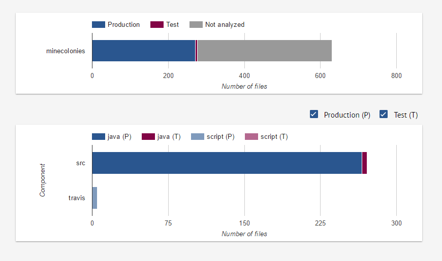
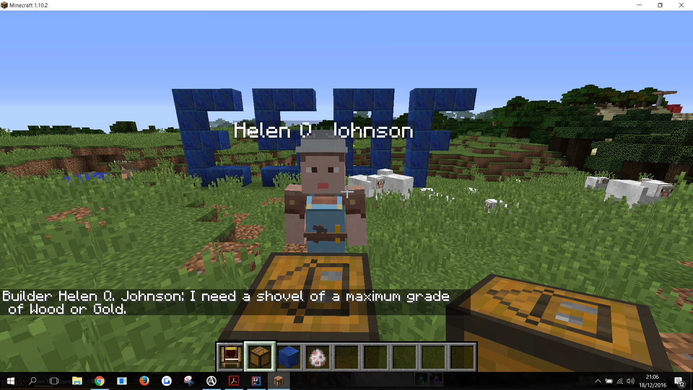
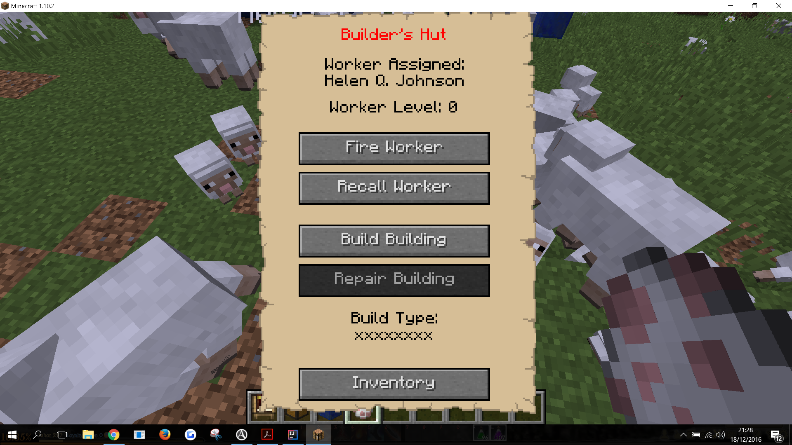
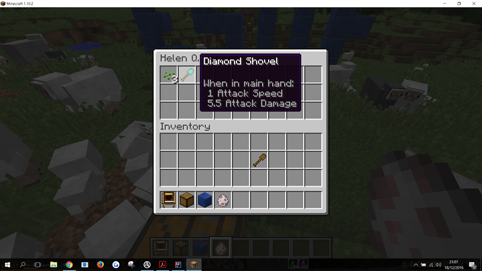
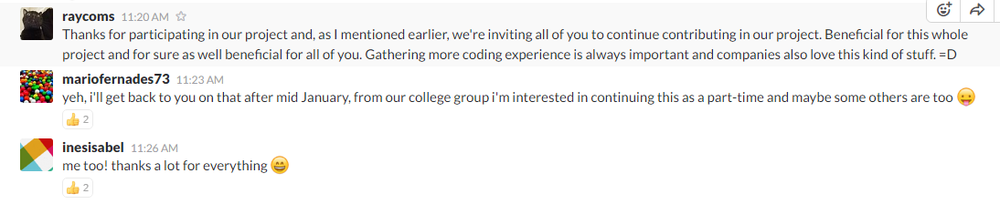

# Assignment 5 - Software Maintenance/Evolution #

## Introdução ##

Dado que o MineColonies é uma modificação de um jogo, existe muito por onde este possa evoluir, tendo em conta, a grande extensão do jogo base. Desta forma, são propostas várias features novas ou até mesmo a resolução de algumas que contém bugs ao longo do tempo. Contudo, a facilidade de manutenção e/ou evolução do software depende também da qualidade do código e como este foi implementado.

## Software Maintainability ##

Como forma de avaliar a facilidade de manutenção deste projeto, foi nos introduzido a ferramenta Better Code Hub que faz esta avaliação, tendo em conta dez parâmetros a seguir descritos, juntamente com a sua classificação (Rejeitado/Aceite).

Figura 1 - *Análise resumida pelo Better Code Hub ao projeto Minecolonies*

- Write Short Units of Code (Rejeitado) - Pequenas unidades de código são mais fáceis de compreender; 
- Write Simple Units of Code (Rejeitado) - Unidades de código mais simples são mais fáceis de testar; 
- Write Code Once (Aceite) - Código duplicado significa erros duplicados e ter que fazer alterações em duplicado;
- Keep Unit Interfaces Small (Rejeitado) - Unidades com interfaces mais pequenas são mais fáceis de reutilizar;
- Separate Concerns in Modules (Rejeitado) - Módulos com uma única responsabilidade são mais fáceis de fazer manutenção;
- Couple Architecture Components Loosely (Aceite) - Componentes independentes podem ser testados em isoladamente;
- Keep Architecture Components Balanced (Aceite) - Com uma arquitectura bem equilibrada é mais intuitivo encontrar o que se pretende;
- Keep Code Base Small (Aceite) - Com um código base pequeno é mais fácil para fazer manutenção;
- Automate Tests (Rejeitado) - Os testes automáticos são repetíveis e ajudam a prevenir erros; 
- Write Clean Code (Aceite).

Figura 2 - *Estatísticas de ficheiros analisados pelo Better Code Hub ao projeto Minecolonies*

Tendo em conta os resultados acima referidos, podemos concluir que a facilidade de manutenção do projeto seria de 50%, contando que, cada parâmetro tem o mesmo peso na avaliação. Estes resultados demonstram que, para o sucesso e facilidade de implementação de futuras features ou outro tipo de manutenção, devia-se apostar mais na qualidade do software de forma a melhorar estes resultados e tentar passar em todos os testes.

## Evolution Process ##

### Identificação ### 

Para a realização do último trabalho prático foi requisitada a implementação de uma nova feature no projeto selecionado. Dada a extensão do projeto e a sua organização, decidimos que a melhor abordagem seria a implementação de um feature dentro da lista das features já selecionadas pela equipa. Posto isto, decidimos escolher a feature [#6 - “Restrict lumberjack tool usage depending on his level“](https://github.com/Minecolonies/minecolonies/issues/6). Esta escolha baseou-se quer no interesse do tema como no grau de dificuldade encontrado. De seguida contactamos a equipa do **Minecolonies** para esclarecer algumas dúvidas e procurar um “ponto de partida”. A equipa mostrou-se, como sempre, disponível e sugeriu ainda a generalização do sistema de níveis para todos os *workers*.

> “That would be something doable, definitely It would be nice if this could be implemented for all workers in a general ai function” - [Marvin](https://github.com/Kostronor)

<a name="descricao"/>
### Descrição ###

A feature a implementar tem como objetivo a implementação de um sistema de níveis, comum a todos os workers (*NPC’s*), que restringe as ferramentas usadas de acordo com o nível do *blockhut* (bloco que associa um trabalhador com a respetiva casa). A declaração de restrições foi nos especificada pelos *developers* como:

* *blockhut* nível 0: apenas ferramentas de nível 0 (sem encantamentos)
* *blockhut* nível 1: ferramentas de nível 0 ou 1 (sem encantamentos)
* *blockhut* nível 2: ferramentas até nível 2 (sem encantamentos)
* *blockhut* nível 3: ferramentas até nível 2 (permite encantamentos)
* *blockhut* nível 4: ferramentas até nível 3 (permite encantamentos)
* *blockhut* nível 5: qualquer tipo de ferramenta (inclui ferramentas extra **Minecraft**)

Os níveis das ferramentas são relativamente ao tipo de material, em que:

* nível 0: madeira e ouro;
* nível 1: pedra;
* nível 2: ferro;
* nível 3: diamante.

<a name="implementacao"/>
### Implementação ###

Para começar a implementação, auxiliamos-nos nas dicas dos *developers* que nos indicaram a classe [abstractEntityAiBasic9](https://github.com/Minecolonies/minecolonies/blob/develop/src/main/java/com/minecolonies/coremod/entity/ai/basic/AbstractEntityAIBasic.java) mais especificamente o método *holdEfficientTool()* que tem como objetivo a escolha do slot com a melhor ferramenta (adequado ao bloco) do inventório. No entanto, após uma análise mais profunda do código, chegamos à conclusão que a implementação não estaria apenas restrita a este método. 

Assim, foi necessário dividir a implementação em vários passos. Fazendo uma abordagem *bottom-up*, o primeiro método, e mais importante, a ser implementado foi:

				verifyToolLevel(final ItemStack item, int level, final int hutLevel)
			
Este método retorna verdadeiro ou falso consoante o **item** recebido respeita o sistema de níveis de acordo com o **level** do bloco com que irá interagir e o **hutLevel** desse *worker*.

Este método é invocado por duas vezes em duas ocasiões distintas:

			hasToolLevel(final String tool, @NotNull final InventoryCitizen inventory, final int hutLevel) 

					getMostEfficientTool(@NotNull final Block target)
				
O primeiro método, também criado pelo grupo, recebe o tipo de **tool** do bloco a interagir, o **inventory** do worker, e o seu **hutLevel**. O seu objetivo é retornar verdadeiro ou falso caso exista alguma **tool** no inventário do *worker* que se adeque ao bloco e respeite o sistema de níveis. Este método é por sua vez invocado nos seguintes métodos

						checkForTool(@NotNull String tool)
							
						checkForPickaxe(final int minlevel)
						
Ambos os métodos têm o mesmo objetivo: verificar se existe alguma ferramenta no inventário do *worker* que o possibilite de executar a sua tarefa. O primeiro método, engloba todas as ferramentas menos a picareta. O segundo método é um caso particular do primeiro, devido às restrições de nível mínimo desta ferramenta (regras do **Minecraft**). Estes métodos são invocados aquando o pedido por parte do jogador ao *NPC* que execute uma tarefa. Se retornar falso, o *worker* (*NPC*) não executará a sua tarefa enquanto não tiver a ferramenta adequada, pedindo-a ao jogador em intervalos de tempo regulares. Se retornar verdadeiro, executa a tarefa. O nosso método é invocado aquando a verificação da existência de ferramentas para executar a tarefa, limitando a escolha dependendo do sistema de níveis.

O segundo método (*getMostEfficientTool()*) já pertencia ao projeto, mas teve de ser ligeiramente alterado para suportar o sistema de níveis. Este método recebe um bloco **target**, e calcula qual a ferramenta adequada para a interação. De seguida percorre o inventário e escolhe (dentro das ferramentas adequadas) a que tem nível maior. Aqui entra o nosso método, pois limita a escolha da maior ferramenta, tendo em consideração o sistema de níveis implementado. Este método é usado quando o *worker* começa a sua tarefa. Embora já existisse a verificação dos níveis no *checkForTools()* (que é executado antes deste método), é necessária uma nova verificação, pois no *checkForTools()* apenas indica se existe pelo menos uma ferramenta válida, e neste método é necessário escolher qual.

Além destes métodos foram necessárias algumas alterações como:

* alteração do conteúdo das mensagens enviadas pelo NPC para o jogador via chat;
* criação do método `swapToolGrade(final int toolGrade)` para a escolha da ferramenta adequada a enviar na mensagem;
* criação de novas constantes;

Os ficheiros alterados podem ser observados na secção de [ficheiros alterados](https://github.com/Minecolonies/minecolonies/pull/352/files) do nosso *pull request*. 

<a name="resultado"/>
### Resultado ###

Para testar o resultado da nossa implementação decidimos pedir a um *worker* do tipo *builder* para construir uma casa, ao que ele pede uma pá do tipo máximo "Madeira" ou "Ouro", como pode ser verificado pela figura 3. 

Figura 3 - *Imagem ilustrativa com o chat após um pedido do NPC ao jogador*

O *worker* pede uma ferramenta deste tipo devido ao nível do seu *blockhut* que, como pode ser verificado na figura 4, é 0. De acordo com o sistema de níveis referido na [descrição](#descricao) da feature, para um *blockhut* de nível zero o *worker* pode apenas usufruir de ferramentas de nível zero, ou seja, madeira e ouro.

Figura 4 - *Imagem ilustrativa de um menu de um blockhut com o seu nível associado*

Assim, ao dar-lhe uma pá do tipo diamante (figura 5), o nosso *NPC* verifica que a pá não pode ser usada e volta ao estado da figura 3, repetindo a frase de tempo a tempo, até receber uma ferramenta adequada. Nesse estado, o *NPC* começa a executar a sua tarefa.

Figura 5 - *Imagem ilustrativa do inventório do worker com uma pá de diamante*

<a name="dificuldades"/>
### Dificuldades ###

A maior dificuldade, já encontrada no relatório anterior, está relacionada com o facto de não conhecermos o código em mãos. Foi necessária muita análise para perceber que métodos seriam mudados, a sua ordem de invocação, e que métodos influenciavam o comportamento antes e pós implementação. 

Outra dificuldade encontrada, já relacionada com o [*pull request*](https://github.com/Minecolonies/minecolonies/pull/352), deveu-se à minuciosidade da equipa do **MineColonies** com o *code style*. O nosso *pull request* foi diversas vezes rejeitado devido a pormenores de *code style* e também, às vezes, de lógica quando certos blocos de código poderiam tornar-se mais eficientes.

<a name="analise"/>
### Análise do impacto desta feature no projeto ###

O impacto desta feature no **MineColonies** é enorme! Até agora, um *NPC* podia usar qualquer ferramenta do seu inventário (adequada ao bloco a interagir). Como o nível das ferramentas influencia a rapidez da quebra de um bloco e a durabilidade da ferramenta, um *NPC* de nível baixo com uma boa ferramenta terminava a sua tarefa muito mais depressa e ganhava muito mais experiência que outro *NPC* que usasse as ferramentas de acordo com o seu nível. Esta mudança permite uma evolução gradual do jogo e igualdade de circunstâncias para todos os jogadores.

## Pull Request ##

[Aqui!](https://github.com/Minecolonies/minecolonies/pull/352)

Após a implementação da *feature*, tal como no *assignment* anterior, foi criado um branch no projeto original, com a implementação da feature, do qual foi feito o *pull request*. Tal como já foi referido no ponto das [dificuldades](#dificuldades), o *pull request* foi diversas vezes rejeitado, até que por fim passou no último parâmetro de [*pull aprove*](https://pullapprove.com/Minecolonies/minecolonies/pull-request/352/?utm_source=github-pr&utm_medium=comment-badge&utm_campaign=Minecolonies/minecolonies), onde [kostronor](https://github.com/Kostronor) e [raycoms](https://github.com/Raycoms) **aceitaram** o nosso *pull request*, fazendo merge com o branch develop!

## Conclusão ##

A cadeira de **ESOF** foi sem dúvida uma mais valia para o nosso percurso escolar. O facto de ter de interagir com novas pessoas e projetos reais, mostrou-nos uma nova perspetiva do mundo da engenharia de software. A aprendizagem tornou-se mais dinâmica e contextualizada permitindo uma melhor absorção do conhecimento. O facto de integrar projetos open-source também serviu de porta de entrada para este mundo da programação que existe e que ainda não tínhamos grande conhecimento.

A escolha do projeto **Minecolonies** também foi sem dúvida enriquecedora, graças à simpatia de todos os elementos que nos ajudaram em tudo o que puderam. A equipa também ficou especialmente grata pela ajuda que lhes prestamos e ainda nos convidou a integrar a equipa!

Figura 6 - *Slack com uma conversa entre intervenientes no projeto*

Concluímos então que os processos de engenharia de software são essenciais nas equipas de qualquer projeto (quer *open-source* quer empresarial). A engenharia de software permite diversas análises aos projetos facilitando a integração de novas pessoas, mas também o desenvolvimento gradual e modular dos projetos.

Além dos agradecimentos ao trabalho espetacular da equipa do **MineColonies** não podemos deixar de agradecer a todos os docentes que permitiram a realização desta cadeira!

## Contribuições ##

* [Inês Gomes](https://github.com/inesgomes) (up201405778@fe.up.pt) - 25% - horas: 9

* [Catarina Ramos](https://github.com/catramos96) (up201406219@fe.up.pt) - 25% - horas: 9

* [Mário Fernandes](https://github.com/MarioFernandes73) (up201201705@fe.up.pt) - 25% - horas: 9

* [Manuel Curral](https://github.com/Camolas)  (up201202445@fe.up.pt) - 25% - horas: 9
