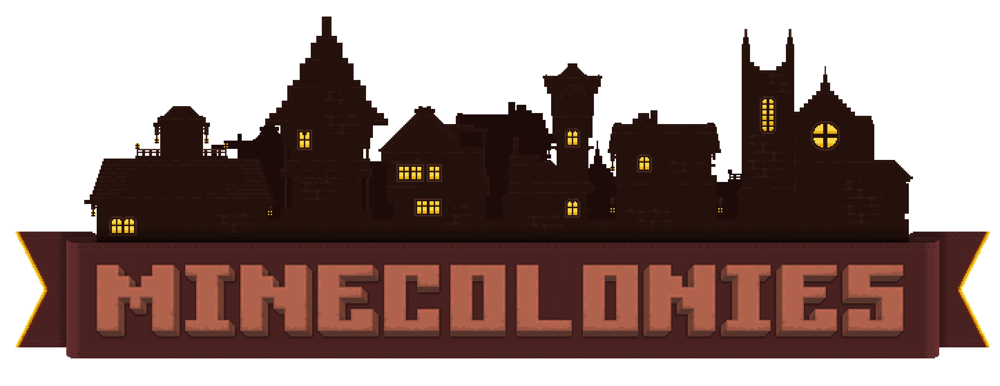

# MineColonies

MineColonies is an interactive building mod that allows you to create a thriving town within Minecraft. It lets your leadership skills soar by providing you with everything you need to build your kingdom. MineColonies gives you the flexibility to create a colony as unique as every player. With so many options, you'll create a different colony every time, adapt it to any biome, build inside a mountain, on top of one, under the ocean, or in the sky.

The limit is your imagination!

MineColonies features NPC workers such as Builders, Farmers, Fishers, Foresters, Guards, Miners, Smelters, Bakers, Cooks, Couriers, five types of animal herders, Composters, and many more, with even more being developed and added as the mod grows.

It also includes specialized buildings such as the Warehouse, House, Town Hall, Barracks, Library, University, and even the School.

#### Website:
https://www.minecolonies.com/

## For Users

You can find all our versions on Curseforge:

https://www.curseforge.com/minecraft/mc-mods/minecolonies/files/all

If you want to chat with the developers and join our amazing community:

https://discord.minecolonies.com

### Creating an Issue

MineColonies crashes every time? Have a suggestion? Found a bug? Create an issue now!

1. Make sure your issue hasn't already been answered or fixed. Also think about whether your issue is a valid one before submitting it.
2. Go to the [issues page](https://github.com/ldtteam/minecolonies/issues).
3. Click `New Issue`
4. Choose which type of issue you want to create.
4. Fill in the form. Don't leave anything out!
5. Click `Submit New Issue` and wait for a response!

## For Developers

### Compiling MineColonies

IMPORTANT: Please report any issues you have, as there might be some problems with the documentation! Also make sure you know EXACTLY what you're doing! It's not our fault if your OS crashes, becomes corrupted, etc.

#### Setup Java
The Java JDK is used to compile MineColonies.

1. Download and install the Java JDK 8.
    * [Windows](https://adoptopenjdk.net/): Choose OpenJDK 8 (LTS) version and HotSpot JVM, then click the `latest release` button. After the download is complete, open the file, accept the license agreement, and in a custom setup make sure that `Add to Path` and `Set JAVA_HOME` are set to `Entire feature will be installed on your local hard drive`. Then choose `Install` and wait for the installation to finish.
    * Linux: Installation methods for certain popular flavors of Linux are listed below. If your distribution is not listed, follow the instructions specific to your package manager or install it manually [here](http://www.oracle.com/technetwork/java/javase/downloads/jdk8-downloads-2133151.html).
		* Gentoo: `emerge dev-java/openjdk-bin:8`
		* Archlinux: `pacman -S jdk8-openjdk`
		* Ubuntu/Debian: `apt-get install openjdk-8-jdk`
		* Fedora: `yum install java-1.8.0-openjdk`
2. Open up your command line and run `javac`. If it spews out a bunch of possible options and the usage, you're good to go. If not, try the steps again.

**Troubleshooting**
If the `javac` command does not work on Windows:
* Go to `Control Panel\System and Security\System` and click on `Advanced System Settings` on the left-hand side.
* Click on `Environment Variables`.
* Under `System Variables`, click `New`.
* For `Variable Name`, input `JAVA_HOME`.
* For `Variable Value`, input something similar to `C:\Program Files\Java\jdk1.8.0_45` exactly as shown (or wherever your Java JDK installation is) and click `OK`.
* Scroll down to a variable named `Path` and double-click on it.
* Append `;%JAVA_HOME%\bin` EXACTLY AS SHOWN and click `OK`. Make sure the location is correct; double-check to make sure.

#### Setup Gradle (Optional)
Gradle is used to execute the various build tasks when compiling MineColonies.

1. Download and install Gradle.
	* [Windows/Mac download link](http://www.gradle.org/downloads). You only need the binaries, but choose whatever flavor you want.
		* Unzip the package and put it wherever you want, for example, `C:\Gradle`.
	* Linux: Installation methods for certain popular flavors of Linux are listed below. If your distribution is not listed, follow the instructions specific to your package manager or install it manually [here](http://www.gradle.org/downloads).
		* Gentoo: `emerge dev-java/gradle-bin`
		* Archlinux: You'll have to install it from the [AUR](https://aur.archlinux.org/packages/gradle).
		* Ubuntu/Debian: `apt-get install gradle`
		* Fedora: Install Gradle manually from its website (see above), as Fedora ships a "broken" version of Gradle. Use `yum install gradle` only if you know what you're doing.
2. Windows: Set environment variables for Gradle.
	* Go back to `Environment Variables` and then create a new system variable.
	* For `Variable Name`, input `GRADLE_HOME`.
	* For `Variable Value`, input something similar to `C:\Gradle-3.0` exactly as shown (or wherever your Gradle installation is), and click `Ok`.
	* Scroll down to `Path` again, and append `;%GRADLE_HOME%\bin` EXACTLY AS SHOWN and click `Ok`. Once again, double-check the location.
3. Open up your command line and run `gradle`. If it says 'Welcome to Gradle [version].', then you're good to go. If not, try the steps again.

#### Setup Git
Git is used to clone MineColonies and update your local copy.

1. Download and install Git [here](http://git-scm.com/download/).
2. *Optional*: Download and install a Git GUI client, such as Gitkraken, SourceTree, GitHub for Windows/Mac, SmartGitHg, TortoiseGit, etc. A nice list is available [here](http://git-scm.com/downloads/guis).

#### Setup MineColonies (Command Line)
This section assumes that you're using the command line version of Git.

1. Open up your command line.
2. Navigate to a place where you want to download the MineColonies source (e.g., `C:\GitHub\MineColonies\`) by executing `cd [folder location]`. This location is known as `basefolder` from now on.
3. Execute `git clone https://github.com/Minecolonies/minecolonies.git`. This will download MineColonies' source into `basefolder`.
4. Right now, you should have a directory that looks something like this:

***
    basefolder
	\-MineColonies
		\-MineColonies' files (should have `build.gradle`)
***

#### Setup MineColonies (GitKraken)
If you decide to go with a GUI client like GitKraken:

1. Open GitKraken
2. Click `File → Clone Repo`
3. Select GitHub.com and choose a base folder to clone to.
4. Write MineColonies in the "Repository to Clone" and select the one by ldtteam.

5. Click 'Clone the Repo'.

#### Compile MineColonies (Command Line)
1. Navigate to the MineColonies folder and run a `dir` to make sure the `build.gradle` file is where you expect it to be.
2. Execute `gradlew build`. This first sets up Forge and downloads the necessary libraries to build MineColonies. Be patient, as this may take a while.
    * If you did everything right, `BUILD SUCCESSFUL` will be displayed after it finishes.
    * If you see `BUILD FAILED`, check the error output (it should be right around `BUILD FAILED`), fix everything (if possible), and try again.
3. Go to `basefolder\MineColonies\build\libs`.
    * You should see a `.jar` file named `MineColonies-universal-null.jar`.
4. Copy the jar into your Minecraft `mods` folder, and you are done! (`~/.minecraft/mods` on Linux)
5. Alternatively, you can also run `./gradlew runClient` to start Minecraft with this jar.

#### Compile MineColonies (Intellij)
1. Right-click the `build.gradle` file (or the background of the folder it's in) and select `Open Folder as Intellij Project`.
2. Select `Auto Import` and make sure a valid Gradle and JVM are selected.

3. This will prepare some of the libraries used by Forge.
4. Click `View → Tool Windows → Gradle`.
5. In the Gradle view, expand the options to `Tasks → fg_runs`.
6. Click the small refresh symbol in the upper left of the Gradle view. This sets up Forge and downloads the necessary libraries to build MineColonies. 
7. Execute `genIntellijRuns` and restart Intellij.
8. You will see a runClient and runServer startup configuration in the dropdown at the top right next to the green "run" button. Select one and press "run".
9. If it doesn't start and throws a lot of errors, try another refresh. This often does wonders.
10. If you want to produce a running jar, execute the `build` task. This will result in a runnable jar file in `basefolder\MineColonies\build\libs`.

##### Troubleshooting
If Gradle synchronization fails, make sure:
1. `File → Project structure → Project → Project SDK` is set to your installed JDK version.
2. `File → Settings → Build, Execution, Deployment → Build Tools → Gradle → Gradle JVM` is set to your installed JDK version.

#### Updating Your Repository
To get the most up-to-date builds, you'll have to update your local repository periodically.

1. Open up your command line.
2. Navigate to `basefolder` in the console.
3. Ensure you have not made any changes to the local repository (if you did, there might be issues with Git).
	* If you have, try reverting them to their status when you last updated your repository.
4. Execute `git pull version/1.16.3`. This pulls all commits from the official repository that do not yet exist on your local repository and updates it (with GitKraken, click the small pull arrow at the top).

#### Troubleshooting
- Sometimes Gradle tasks fail because of missing memory. For that, you can find system-wide settings in the `.gradle` folder of your `HOME` directory (`~/.gradle/gradle.properties` or on Windows in `C:\Users\username\.gradle\gradle.properties`).
- Sometimes after a branch change, libraries can not be resolved. Running another refresh in IntelliJ or the command line usually solves this issue.

### Contributing

#### Submitting a PR
Found a bug in our code? Think you can make it more efficient? Want to help in general? Great!

1. If you haven't already, create a GitHub account.
2. Click the `Fork` icon located at the top right.
3. Make your changes and commit them.
	* If you're making changes locally, you'll have to do `git commit -a` and `git push` in your command line (or with GitKraken stage the changes, commit them, and push them first).
4. Click `Pull Request` in the middle.
5. Click 'New pull request' to create a pull request for this comparison, enter your PR's title, and create a detailed description telling us what you changed.
6. Click `Create pull request` and wait for feedback!
